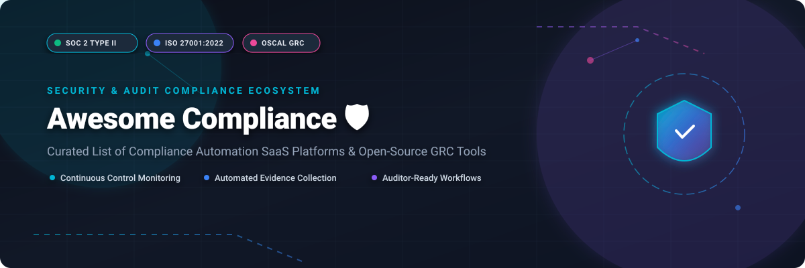

<p align="center">
  <a href="https://github.com/ishandutta2007/Awesome-Awesome-Awesome"></a>
  <a href="https://discord.gg/jc4xtF58Ve"></a>
  <a href="https://github.com/ishandutta2007/Awesome-Compliance/stargazers"></a>
  <a href="https://github.com/ishandutta2007/Awesome-Compliance/network/members"></a>
  <a href="https://github.com/ishandutta2007/Awesome-Compliance/blob/main/LICENSE"></a>
  <a href="https://github.com/ishandutta2007"></a>
</p>



# Awesome Compliance 🛡️

> **A Curated Ecosystem of Compliance Automation SaaS Platforms & Open-Source Security Tools**  
> *Focused on SOC 2, ISO 27001, GDPR, HIPAA, Evidence Collection, Continuous Control Monitoring, OSCAL & GRC Engineering.*

---

## 📌 Table of Contents

- [🛡️ Overview](#️-overview)
- [📊 Compliance Automation Market Analysis](#-compliance-automation-market-analysis)
- [💼 SaaS Platforms & Vendor Landscape](#-saas-platforms--vendor-landscape)
- [🔓 Open-Source Security & GRC Tools](#-open-source-security--grc-tools)
- [💡 Architectural Playbooks & Frameworks](#-architectural-playbooks--frameworks)
- [🤝 Support & Sponsorship](#-support--sponsorship)
- [🤝 How to Contribute](#-how-to-contribute)
- [📈 Star History](#-star-history)
- [📜 Disclaimer](#-disclaimer)

---

## 🛡️ Overview

This repository tracks top commercial **SaaS platforms** and **open-source GitHub projects** dedicated to **Security Compliance**, continuous control monitoring, and GRC (Governance, Risk, and Compliance). These solutions connect directly into cloud providers (AWS, GCP, Azure), identity management systems (Okta, Google Workspace), HR tools, and developer codebases (GitHub, GitLab) to automate evidence acquisition, map technical controls to regulatory frameworks, and drastically streamline audit readiness.

Whether you are preparing your startup for its first **SOC 2 Type II** or **ISO 27001** audit, or managing enterprise-wide **NIST 800-53** / **GDPR** risk management programs, this directory provides data-driven comparisons across both commercial and open-source tooling.

---

## 📊 Compliance Automation Market Analysis

> 💡 **Market Size & Structure (2026):** The global Security Compliance Automation & GRC software market is estimated at **$5.2 Billion** in 2026 and is projected to reach **$12.5 Billion** by 2030, expanding at a CAGR of ~19.4%. The sector is **moderately fragmented**. While category-defining leaders like OneTrust, Vanta, AuditBoard, and Drata hold dominant market share across SMB and enterprise tiers, rapid growth continues to drive specialization around compliance-as-code, open OSCAL standards, and developer-centric evidence pipelines.

---

## 💼 SaaS Platforms & Vendor Landscape

The following curated table compares leading compliance automation and enterprise GRC SaaS platforms. 

*Table sorted by **Company Scale & Valuation** (descending).*

| SaaS Platform 🚀 | Platform Description 📝 | Starting Pricing 💵 | Free Tier / Trial Limits ⏳ | Company Scale & Valuation 📈 |
| :--- | :--- | :--- | :--- | :--- |
| **[OneTrust](https://www.onetrust.com/)** 🛡️ | Enterprise GRC, privacy governance, third-party risk, and trust intelligence platform across global regulatory domains. | **$800/mo** ($9,600/yr starting tier) | 14-day free trial (select Privacy & Consent modules) | **~$4.5 Billion Valuation** ($500M+ ARR) |
| **[Vanta](https://www.vanta.com/)** ⚡ | Market leader in compliance automation for SOC 2, ISO 27001, HIPAA, continuous monitoring, and trust center management. | **$625/mo** ($7,500/yr starting tier) | 14-day interactive demo & pilot upon sales approval | **$4.2 Billion Valuation** ($300M+ ARR) |
| **[AuditBoard](https://www.auditboard.com/)** 🏢 | Enterprise internal audit, SOX compliance, enterprise risk management (ERM), and IT GRC platform. | **$2,500/mo** ($30,000/yr starting tier) | 7-day managed sandbox demo upon sales qualification | **$3.1 Billion Valuation** ($200M+ ARR) |
| **[Drata](https://drata.com/)** 🤖 | Continuous automated evidence collection platform with 85+ native integrations, risk management, and multi-framework support. | **$625/mo** ($7,500/yr starting tier) | 14-day sales-assisted trial period available on request | **$2.0 Billion Valuation** ($100M+ ARR) |
| **[Secureframe](https://secureframe.com/)** 🔐 | Automated SOC 2, ISO 27001, CMMC, and HIPAA compliance suite with AI-assisted control remediation and evidence collection. | **$583/mo** ($7,000/yr starting tier) | 14-day guided trial/pilot during sales evaluation | **~$500 Million Valuation** ($40M+ ARR) |
| **[Hyperproof](https://hyperproof.io/)** 📊 | Compliance program and audit management system designed for continuous control mapping, risk tracking, and evidence operations. | **$833/mo** ($10,000/yr starting tier) | 14-day guided proof-of-concept for qualified security teams | **~$250 Million Valuation** ($30M+ ARR) |
| **[LogicGate](https://www.logicgate.com/)** ⚙️ | Highly configurable Risk Cloud platform offering customizable compliance workflows, control mapping, and risk quantification. | **$1,250/mo** ($15,000/yr starting tier) | Custom sandbox demo environment provided on request | **~$200 Million Valuation** ($25M+ ARR) |
| **[Thoropass](https://thoropass.com/)** 🤝 | Integrated compliance solution combining automated evidence collection software with embedded auditor services for SOC 2/ISO. | **$750/mo** ($9,000/yr starting tier) | Free tier for DDQ tool; 14-day trial for main platform | **~$150 Million Valuation** ($20M+ ARR) |
| **[Sprinto](https://sprinto.com/)** 🎯 | Engineering-friendly compliance automation platform designed for fast SOC 2, ISO 27001, and GDPR readiness. | **$416/mo** ($5,000/yr starting tier) | 14-day full feature trial available upon request | **$35 Million Valuation** ($20M+ ARR) |
| **[Scytale](https://scytale.ai/)** 🚀 | Compliance automation platform assisting growing technology startups in accelerating SOC 2 and ISO audit preparation. | **$375/mo** ($4,500/yr starting tier) | 14-day guided sandbox demo for early-stage startups | **~$30 Million Valuation** ($10M+ ARR) |

---

## 🔓 Open-Source Security & GRC Tools

While full commercial suites offer turn-key auditor networks, an expanding ecosystem of open-source software empowers security engineers to build transparent, self-hosted, and lock-in-free compliance pipelines.

*List sorted by **GitHub Stars** (descending).*

1. **[Trivy](https://github.com/aquasecurity/trivy)** [](https://github.com/aquasecurity/trivy/stargazers) 🔍  
   Comprehensive, versatile security scanner for container images, file systems, Git repositories, infrastructure-as-code (IaC), Kubernetes configurations, and SBOMs.

2. **[Wazuh](https://github.com/wazuh/wazuh)** [](https://github.com/wazuh/wazuh/stargazers) 🛡️  
   Open-source security monitoring, threat detection, integrity monitoring, and continuous regulatory compliance enforcement platform (PCI DSS, HIPAA, NIST 800-53, GDPR).

3. **[Prowler](https://github.com/prowler-cloud/prowler)** [](https://github.com/prowler-cloud/prowler/stargazers) ☁️  
   Multi-cloud security assessment, continuous auditing, and compliance framework scanner for AWS, Azure, GCP, and Kubernetes (CIS Benchmarks, SOC 2, ISO 27001).

4. **[Open Policy Agent (OPA)](https://github.com/open-policy-agent/opa)** [](https://github.com/open-policy-agent/opa/stargazers) 📜  
   Unified open-source policy engine enabling policy-as-code enforcement across microservices, Kubernetes clusters, CI/CD pipelines, and cloud APIs.

5. **[Cloud Custodian](https://github.com/cloud-custodian/cloud-custodian)** [](https://github.com/cloud-custodian/cloud-custodian/stargazers) ☁️  
   Stateless rules engine for real-time cloud security, automated governance, continuous compliance policy enforcement, and cloud resource cost management.

6. **[DefectDojo](https://github.com/DefectDojo/django-DefectDojo)** [](https://github.com/DefectDojo/django-DefectDojo/stargazers) 🐛  
   Application vulnerability management and audit evidence correlation tool designed to streamline security compliance tracking across dev pipelines.

7. **[CISO Assistant](https://github.com/intuitem/ciso-assistant-community)** [](https://github.com/intuitem/ciso-assistant-community/stargazers) 💼  
   Open-source GRC platform designed to automate cybersecurity risk management, control mapping, and multi-framework audit workflows (ISO 27001, NIS2, NIST CSF).

8. **[ComplianceAsCode](https://github.com/ComplianceAsCode/content)** [](https://github.com/ComplianceAsCode/content/stargazers) 💻  
   Open security compliance content project delivering automated SCAP, OSCAL, and Ansible security hardening rules for enterprise Linux operating systems and cloud platforms.

9. **[OSCAL (NIST)](https://github.com/usnistgov/OSCAL)** [](https://github.com/usnistgov/OSCAL/stargazers) 🏛️  
   Open Security Controls Assessment Language developed by NIST—standardized, machine-readable JSON/YAML formats for control catalogs, system security plans (SSPs), and assessment results.

10. **[Openlane](https://github.com/theopenlane/core)** [](https://github.com/theopenlane/core/stargazers) 🏗️  
    Open-source continuous compliance automation platform supporting SOC 2, ISO 27001, GDPR, and NIST 800-53 policy management, control registries, and evidence pipelines.

11. **[OCEAN](https://github.com/grcengineering/OCEAN)** [](https://github.com/grcengineering/OCEAN/stargazers) 🌊  
    Open-source CLI and engine for continuous control testing, active evidence collection, normalization, and auditor-ready data pipeline integration.

---

## 💡 Architectural Playbooks & Frameworks

Building a self-hosted compliance pipeline with open-source software follows this architecture:

```
[Cloud / Identity / Git Systems] 
              │
              ▼ (APIs & Scanners: Prowler, Trivy, OPA)
   [Automated Evidence & Attestations]
              │
              ▼ (Normalizers: OSCAL / OCEAN)
   [Open GRC Core / Registry (Openlane / CISO Assistant)]
              │
              ▼
   [Auditor-Ready Reports & Trust Dashboards]
```

- **Open-source strengths**: Total data privacy, custom policy integration, zero vendor lock-in, and developer-native GitOps workflows.
- **Commercial strengths**: Pre-packaged auditor networks, automated vendor risk management, white-glove onboarding, and polished Trust Centers.

---

## 🤝 Support & Sponsorship

If you find this curated compliance ecosystem list valuable for your security, audit, or GRC workflows:
- 🌟 **Star this repository** to help others discover it.
- 🔀 **Fork & Share** with your security and engineering teams.
- ☕ **Sponsor / Buy me a coffee**: Support ongoing maintenance and open-source compliance research via the [GitHub Sponsor Dashboard](https://github.com/sponsors/ishandutta2007).

---

## 🤝 How to Contribute

1. **Fork** the repository on GitHub.
2. Update or add entries to `README.md` following the tabular or bulleted format.
3. Ensure description links point to official websites/repositories and keep pricing/feature metrics factual.
4. Submit a **Pull Request** with a brief summary of additions.

Curated list inspired by the awesome standard: check out [Awesome-Awesome-Awesome](https://github.com/ishandutta2007/Awesome-Awesome-Awesome) for more curated lists.

---

## 📈 Star History

[](https://star-history.dera.page/#ishandutta2007/Awesome-Compliance&type=date&legend=top-left)

---

## 📜 Disclaimer

This list is community-curated for educational and informational purposes only. It does not constitute legal or professional security audit advice. Compliance management requires continuous internal controls, policy implementation, and auditor verification.
